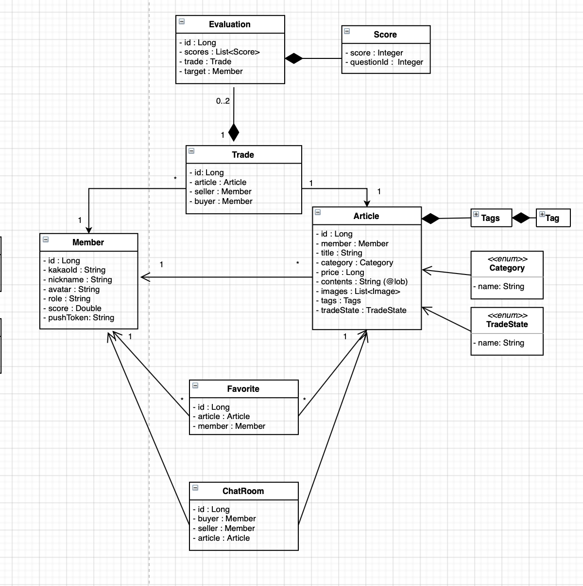
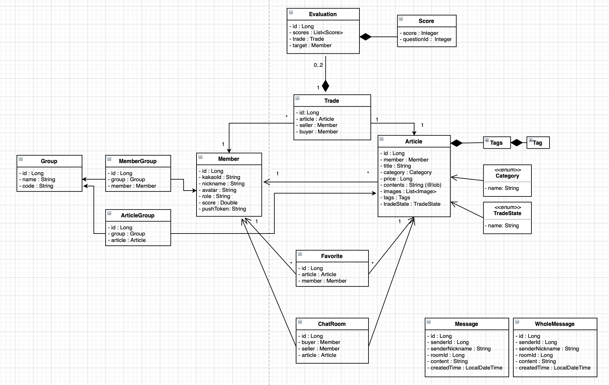
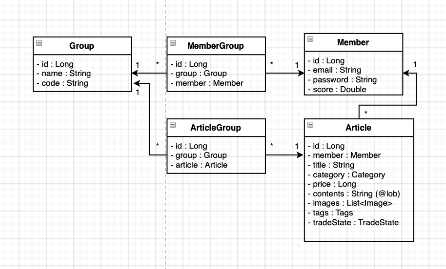

# 🐳 JIKGORAE-Project-records
#### 본 저장소의 목적은 [우아한테크코스 팀 프로젝트](https://github.com/woowacourse-teams) 를 진행하면서 했던 내용들을 정리하는 것입니다.  

## 직고래 
당신이 속한 그룹 어디든 당신이 원하는 것을 사고 파세요. 조직 중고 거래, 직고래 🐳

> 따뜻한 교류가 있는 조직 벼룩시장을 꿈꾸다

- [직고래 Github](https://github.com/woowacourse-teams/2020-seller-lee-company)
- [직고래 소개](https://sites.google.com/woowahan.com/wooteco-demo/직고래)

## 기술 스택


## 프로젝트 아키텍처

## CI/CD

- CI
    - 정기적인 빌드 및 테스트(유닛테스트 및 통합테스트)를 거쳐 공유 레포지터리에 병합되는 과정
- CD
    - 레포지터리에서 실시간으로 프로덕션 환경으로 배포하는 작업을 자동화하는 것     

사용자의 피드백을 적극 반영하기 위해 짧은 주기로 서비스를 배포하고 있습니다.
잦은 빌드와 배포로 인해 번거로움을 느꼈고 CI/CD 환경을 구성하여문제를 해결하였습니다.
## 패키지 구조
```gherkin
api
  ├── article
  │   ├── application
  │   ├── domain
  │   ├── exception
  │   ├── presentation
  │   └── query
  ├── articlefavoritecount
  │   ├── application
  │   └── domain
  ├── articleorganization
  │   ├── application
  │   └── domain
  ├── chatroom
  │   ├── application
  │   ├── domain
  │   ├── presentation
  │   └── query
  ├── common
  │   ├── aop
  │   ├── config
  │   └── exception
  ├── favorite
  │   ├── application
  │   ├── domain
  │   ├── presentation
  │   └── query
  ├── member
  │   ├── application
  │   └── presentation
  ├── memberOrganization
  │   ├── application
  │   ├── domain
  │   ├── exception
  │   └── presentation
  ├── organization
  │   ├── application
  │   ├── domain
  │   ├── exception
  │   ├── presentation
  │   └── query
  ├── security
  │   ├── config
  │   ├── core
  │   ├── filter
  │   ├── handler
  │   ├── oauth2
  │   │   ├── authentication
  │   │   ├── provider
  │   │   └── service
  │   └── web
  └── trade
      ├── application
      ├── domain
      └── presentation
```
```gherkin
chat
  ├── config
  ├── message
  │   ├── application
  │   ├── domain
  │   └── presentation
  └── wholeMessage
      ├── application
      ├── domain
      └── presentation
```

# Level 3
  * [도메인 설계](#도메인-설계)
  * [첫번째 클레스 다이어그램](#첫번째-클레스-다이어그램)
  * [프로젝트에서 맡은 주된 업무](#프로젝트에서-맡은-주된-업무)
    + [Front](#front)
    + [Back](#back)
  * [Spring Securtiy](#spring-securtiy)
  * [HTTPS](#https)
  * [고민들](#고민들)
  
## 도메인 설계
첫 도메인 설계 때 많은 회의를 하였습니다. 그중 가장 화두가 됐던 것은 **DDD 패턴을 적용할까?** 입니다.
기술 스택 스펙트럼을 너무 넓게 잡은 우리 팀은 DDD 패턴을 알고 있는 크루가 많이 없었기 때문에 걱정하였습니다.
DDD 패턴을 사용하지 않는다면 패키지 분리가 되어있지 않아 도메인 간의 aggregate를 파악하기 쉽지 않습니다.
그렇기 때문에 Aggregate 내부의 Entity나 VO에 접근할 때 주체가 되는 Aggregate Root을 참조하지 않고 접근해 데이터의 무결성이 깨질 수 있는 가능성이 있습니다.
DDD 패턴을 적용해 생명주기가 같은 변경단위별로 패키지를 분리해 구조를 파악하기 쉽게 하고 애플리케이션 또는 그 안의 **모듈 간의 의존성은 최소화하고, 응집성은 최대화**
할 수 있도록 설계하였습니다.

우리 팀이 도메인 설계를 하면서 주로 했던 고민입니다.
- Spring data 쓰다 보면 Aggregate 개념을 적용하게 됩니다. ([참고](https://www.slideshare.net/HyeonSeokChoi/ddd-repository)) 그래서 변경단위를 어떻게 가져가야 할 것인가에 대한 고민이 있었습니다.
- DDD의 핵심 목표 중 하나인 "Loosely coupling" 은 복잡한 연관 관계가 적용되면 연관된 객체에 대해 변경의 일관성을 유지하기 힘듭니다. 따라서 객체 참조보다
Id 참조를 함으로써 연관 관계를 없애 일관성을 더 쉽게 유지고할 수 있습니다. <br/>
JPA를 학습하고 적용해보고 싶었던 우리는 DDD 에 맞게 단순히 id 참조를 하는 Spring data JDBC를 와 Spring data JPA 중 결정해야 했습니다.
- 단방향 참조를 하다 보니 참조를 통해 생긴 foreign key constrain 문제들 중 cascade 같은 문제들을 어떻게 해결하느냐는 고민이 있었습니다.

해당 고민에 대해 이렇게 해결하였습니다.
- DDD 의 Aggregate 개념을 적용해 패키지를 구조화하였습니다.
그런데 Aggregate 하는 변경단위라는 것이 누가 어떻게 생각하는 거에 따라 다른 것 같아서 많은 논쟁이 있었고 이 구조에 대해서는 계속 바뀔 수 있을 것 같습니다.
- JPA를 학습하고 싶은 욕구가 많았기 때문에 객체 참조를 하는 JPA를 쓰되 하나의 Aggregate에 하나의 Repository를 만들어 관리하였습니다.
- 양방향을 통해 mapped By 로 해결하던가 단방향 cascade 옵션을 걸어주는 방식이 해결하기로 했습니다.

- 참고
    - [Domain-Driven Design and MVC Architectures](https://blog.fedecarg.com/2009/03/11/domain-driven-design-and-mvc-architectures/)
    - [카카오헤어샵의 DDD](https://brunch.co.kr/@cg4jins/7) 
    - [DDD 핵심만 빠르게](https://happycloud-lee.tistory.com/94)
    - [DDD, Aggregate](https://medium.com/@chanhyeonglee/ddd-aggregate-애그리거트-98d9c1313c23)
    - [애그리게잇 하나에 리파지토리 하나](https://medium.com/@SlackBeck/애그리게잇-하나에-리파지토리-하나-f97a69662f63)
    
## 첫번째 클레스 다이어그램
 

## 프로젝트에서 맡은 주된 업무
### Front
- React Native, Expo, TypeScript, Recoil, Axios
    - 프론트는 팀원 모두 학습하며 진행해야 했기 때문에 이슈를 골고루 가져갔습니다.
### Back
- Spring Securtiy, Nginx, Https

프로젝트에서 혼자서 맡게 된 기술들입니다. 새로운 기술을 적용하면서 공부했던 방법과 내용, 고민들을 공유하겠습니다.

## Spring Securtiy
🔒[Spring Security란?](security/Security.md)

🔑[Spring Security Architectures](security/SecurityArchitectures.md)

### HTTPS

🔒[HTTPS](security/https.md)

### 고민들

🤵[고민들](TroubleShoot.md)

# Level 4
 * [도메인](#도메인)
    + [추가된 도메인](#추가된-도메인)
 * [무중단 배포](#무중단배포)
## 도메인

### 추가된 도메인


## 무중단 배포
- [무중단 배포](deploy/deploy.md)

### 변경해볼 사항 
멀티모듈로 인한 인증인가 문제 
