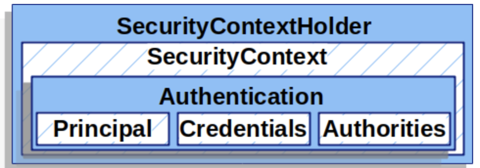
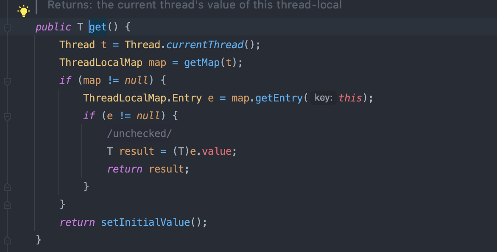
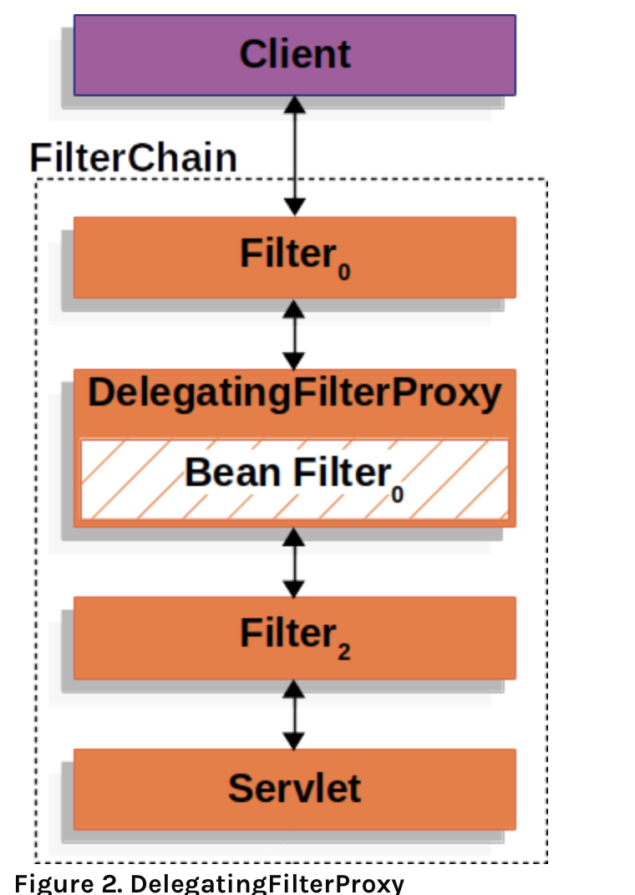
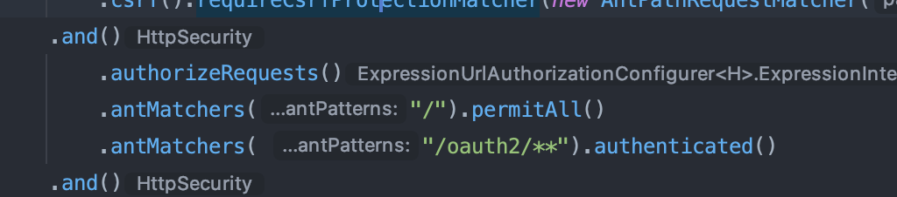
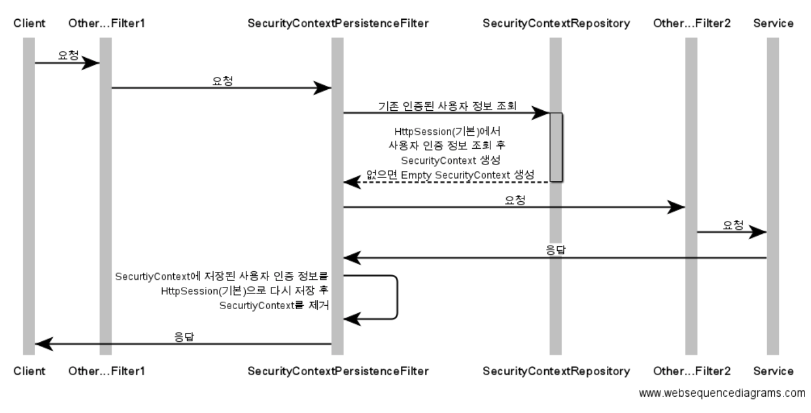
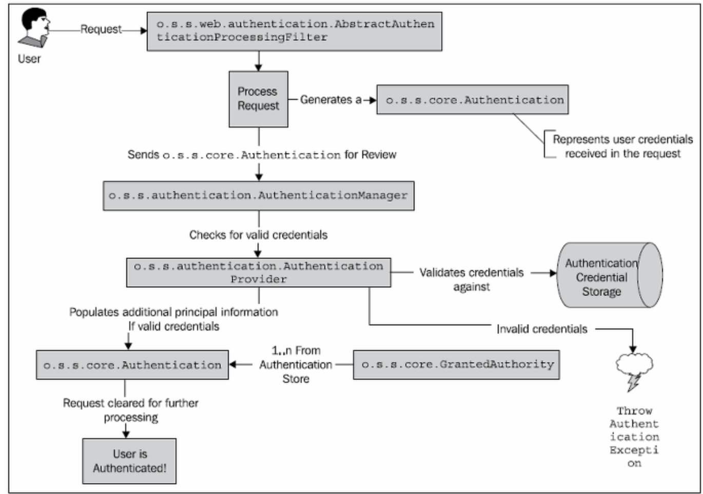
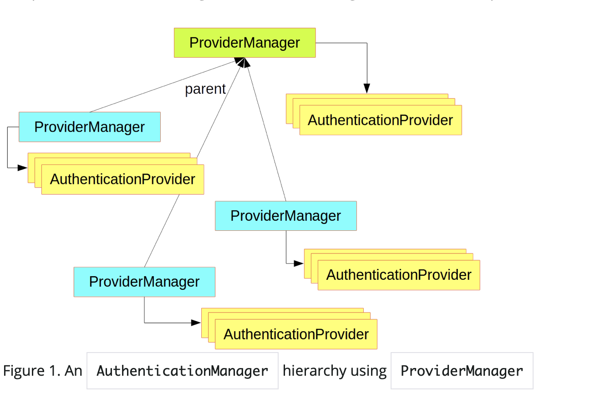
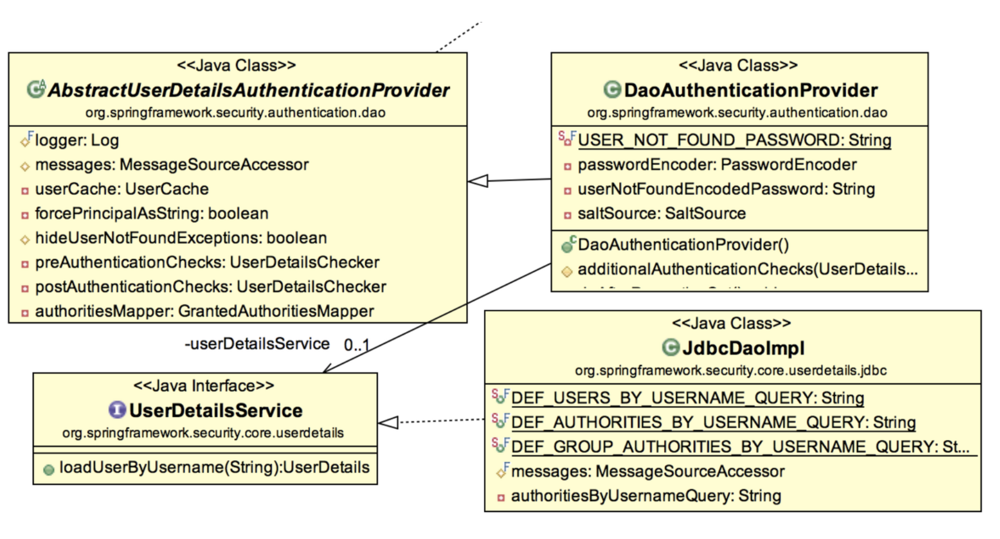

# 🐳 JIKGORAE-Project-records
#### 본 저장소의 목적은 [우아한테크코스 팀 프로젝트](https://github.com/woowacourse-teams) 를 진행하면서 했던 내용들을 정리하는 것입니다.  

## 직고래 
당신이 속한 그룹 어디든 당신이 원하는 것을 사고 파세요. 조직 중고 거래, 직고래 🐳

> 따뜻한 교류가 있는 조직 벼룩시장을 꿈꾸다

- [직고래 Github](https://github.com/woowacourse-teams/2020-seller-lee-company)
- [직고래 소개](https://sites.google.com/woowahan.com/wooteco-demo/직고래/)

## 기술 스택


## 패키지 구조
```gherkin
api
  ├── article
  │   ├── application
  │   ├── domain
  │   ├── presentation
  │   └── query
  ├── articleFavoriteCount
  │   ├── application
  │   └── domain
  ├── articleOrganization
  │   ├── application
  │   └── domain
  ├── chatroom
  │   ├── application
  │   ├── domain
  │   ├── presentation
  │   └── query
  ├── common
  │   └── config
  ├── evaluation
  │   ├── application
  │   ├── domain
  │   └── presentation
  ├── favorite
  │   ├── application
  │   ├── domain
  │   └── presentation
  ├── member
  │   ├── application
  │   ├── domain
  │   └── presentation
  ├── memberOrganization
  │   ├── application
  │   ├── domain
  │   └── presentation
  ├── organization
  │   ├── application
  │   ├── domain
  │   ├── presentation
  │   └── query
  ├── security
  │   ├── config
  │   ├── core
  │   ├── filter
  │   ├── handler
  │   ├── oauth2
  │   │   ├── authentication
  │   │   ├── provider
  │   │   └── service
  │   └── web
  └── trade
      ├── application
      ├── domain
      └── presentation
```
```gherkin
chat
  ├── config
  ├── message
  │   ├── application
  │   ├── domain
  │   └── presentation
  └── wholeMessage
      ├── application
      ├── domain
      └── presentation
```

# Level 3

## 도메인 설계
첫 도메인 설계 때 많은 회의를 하였습니다. 그중 가장 화두가 됐던 것은 **DDD 패턴을 적용할까?** 입니다.
기술 스택 스펙트럼을 너무 넓게 잡은 우리 팀은 DDD 패턴을 알고 있는 크루가 많이 없었기 때문에 걱정하였습니다.
DDD 패턴을 사용하지 않는다면 패키지 분리가 되어있지 않아 도메인 간의 aggregate를 파악하기 쉽지 않습니다.
그렇기 때문에 Aggregate 내부의 Entity나 VO에 접근할 때 주체가 되는 Aggregate Root을 참조하지 않고 접근해 데이터의 무결성이 깨질 수 있는 가능성이 있습니다.
DDD 패턴을 적용해 생명주기가 같은 변경단위별로 패키지를 분리해 구조를 파악하기 쉽게 하고 애플리케이션 또는 그 안의 **모듈 간의 의존성은 최소화하고, 응집성은 최대화**
할 수 있도록 설계하였습니다.

우리 팀이 도메인 설계를 하면서 주로 했던 고민입니다.
- Spring data 쓰다 보면 Aggregate 개념을 적용하게 됩니다. ([참고](https://www.slideshare.net/HyeonSeokChoi/ddd-repository)) 그래서 변경단위를 어떻게 가져가야 할 것인가에 대한 고민이 있었습니다.
- DDD의 핵심 목표 중 하나인 "Loosely coupling" 은 복잡한 연관 관계가 적용되면 연관된 객체에 대해 변경의 일관성을 유지하기 힘듭니다. 따라서 객체 참조보다
Id 참조를 함으로써 연관 관계를 없애 일관성을 더 쉽게 유지고할 수 있습니다. <br/>
JPA를 학습하고 적용해보고 싶었던 우리는 DDD 에 맞게 단순히 id 참조를 하는 Spring data JDBC를 와 Spring data JPA 중 결정해야 했습니다.
- 단방향 참조를 하다 보니 참조를 통해 생긴 foreign key constrain 문제들 중 cascade 같은 문제들을 어떻게 해결하느냐는 고민이 있었습니다.

해당 고민에 대해 이렇게 해결하였습니다.
- DDD 의 Aggregate 개념을 적용해 패키지를 구조화하였습니다.
그런데 Aggregate 하는 변경단위라는 것이 누가 어떻게 생각하는 거에 따라 다른 것 같아서 많은 논쟁이 있었고 이 구조에 대해서는 계속 바뀔 수 있을 것 같습니다.
- JPA를 학습하고 싶은 욕구가 많았기 때문에 객체 참조를 하는 JPA를 쓰되 하나의 Aggregate에 하나의 Repository를 만들어 관리하였습니다.
- 양방향을 통해 mapped By 로 해결하던가 단방향 cascade 옵션을 걸어주는 방식이 해결하기로 했습니다.

- 참고
    - [Domain-Driven Design and MVC Architectures](https://blog.fedecarg.com/2009/03/11/domain-driven-design-and-mvc-architectures/)
    - [카카오헤어샵의 DDD](https://brunch.co.kr/@cg4jins/7) 
    - [DDD 핵심만 빠르게](https://happycloud-lee.tistory.com/94)
    - [DDD, Aggregate](https://medium.com/@chanhyeonglee/ddd-aggregate-애그리거트-98d9c1313c23)
    - [애그리게잇 하나에 리파지토리 하나](https://medium.com/@SlackBeck/애그리게잇-하나에-리파지토리-하나-f97a69662f63)
    
## 첫번째 클레스 다이어그램
 

## 프로젝트에서 맡은 주된 업무
### Front
- React Native, Expo, TypeScript, Recoil, Axios
    - 프론트는 팀원 모두 학습하며 진행해야 했기 때문에 이슈를 골고루 가져갔습니다.
### Back
- Spring Securtiy(OAuth2), Nginx, Https, Logback

프로젝트에서 혼자서 맡게 된 기술들입니다. 새로운 기술을 적용하면서 공부했던 방법과 내용, 고민들을 공유하겠습니다.

## Spring Securtiy(OAuth2 적용기)
### 왜 Spring Securtiy 인가?
우선 시큐리티를 적용하기 전에 Form 형식의 회원가입을 통해 Member를 생성하였습니다.
하지만 '실제 운영해야 할 서비스이기 때문에 개인정보에 대한 보안에 신경 써야 하지 않을까?'라고 생각했고 보안 수준을 높일 방법이 뭐가 있을까 생각을 하였을 때
간단하지만 강력하게 구현 할 수 있는 이미 높은 보안 수준을 구축해둔 Spring Security를 사용하기로 선택했습니다.
Spring Security는 강력하면서도 쉽습니다. 게다가 단 몇십 줄의 코드만으로도 대형 웹서비스 사와 비슷한 수준의 보안을 유지할 수 있다는 장점이 있습니다.
Spring Security는 스프링 기반의 애플리케이션에서 보안을 위해 **인증**과 **권한 부여**를 사용하여 **접근을 제어**하는 프레임워크입니다. 또 커스터마이징이 가능합니다.

### Spring Security가 제공하는 기능들

다양한 기능들이 있습니다. 만약 Spring Security를 적용하지 않는다면 위의 기능들 중 필요한 부분을 모두 손수 다 구현해야 한다는 것입니다.

**그러니 안 쓸 이유가 없겠죠?**

또 Security에서 OAuth2를 Resource sever 로서 구현을 할 수도 있고 Client 로서 사용할 수 있도록 만들어 두었습니다.
Spring Security를 이용하지 않고 RestTemplate이나 WebClient로 OAuth를 제공하는 서비스에 API 요청을 쏘고 Redirect를 구현해 OAuth를 이용할 수 있지만
그 모든 게 Spring Security에 구현이 되어있기 때문에 Spring Security를 사용해 카카오 OAuth 서비스를 이용하였습니다.

하지만 이에 따른 대가가 있는데 너무 높은 추상화 수준 때문에 역추적이 쉽지가 않고 직접 디버깅을 하면서 따라가지 않으면 그 흐름을 파악하기 어렵다는 것입니다. 😭
그래서 먼저 기본적인 Spring Security [아키텍처](https://spring.io/guides/topicals/spring-security-architecture) 에 대해 알고 가야 한다고 생각하였고 학습 후 디버깅을 해보며 따라갔을 때 더 빠르게 흡수 할 수 있었습니다.

- 참고
    - [Spring Security 스프링 시큐리티](https://sieunlim.tistory.com/19)
    - [Spring Security Docs](https://docs.spring.io/spring-security/site/docs/5.1.5.RELEASE/reference/htmlsingle/#hello-web-security-java-configuration)

### Spring Security의 구동원리, 아키택처
#### 왜 알아야 할까?
OAuth를 적용하기 전에 먼저 Spring Security의 구동원리와 아키텍처에 대해 먼저 학습하였습니다. 처음에는 무턱대로 블로그의 글을 복붙하는 형식이였습니다.
코드를 그런식으로 긁어와 사용하니 그에 따른 부작용은 더욱 컸습니다. 여러 부작용들이 많았지만 가장 큰 두가지를 공유하겠습니다.

- 구현을 하는 사람이지만 OAuth 로그인 흐름을 파악하지 못했습니다.
- 우리 프로덕트 환경에서 필요없는 코드들이 생겨났고 그 값들이 DB에 저장되기 까지 했습니다.

이런 부작용을 없애기 위해서는 학습이 무조건 적으로 필요했습니다.

**먼저 Spring Security 를 알기 전에 미리 알아가고 들어가야할 개념 몇가지를 소개하겠습니다.**

### 용어
용어에 대해 먼저 알아보겠습니다. 그 나라의 언어를 모른다면 의사소통이 가능할까요? 시큐리티를 잘 이해하기 위해선 먼저 알고가야한다 생각합니다. 
- 접근 주체(Principal): 보호된 대상에 접근하는 유저
- 인증(Authenticate): 요청을 보낸 유저가 누구인지 확인(ex. 로그인), 애플리케이션의 작업을 수행할 수 있는 주체임을 증명
- 인가(Authorization): 현재 유저가 어떤 서비스, 페이지에 접근할 수 있는 권한을 부여
    - 권한: 인증된 주체가 애플리케이션의 동작을 수행할 수 있는 권한
        - 먼저 인증 과정을 통해 주체가 증명 된 이후 권한을 부여할 수 있음
        - 권한 부여에도 두 가지 영역이 존재하는데 웹 요청 권한, 메소드 호출 및 도메인 인스턴스에 대한 접근 권한 부여가 있음
    +)인증과 권한을 구분해 생각하는 것이 스프링 시큐리티를 이해하는데 가장 중요합니다.
- 증명서(Credential) : 인증 과정 중, 주체가 본인을 인증하기 위해 서버에 제공하는 것. (ID, Password 같은 것)

### SecurityContextHolder

레퍼런스에 보면 SecurityContextHolder 를 다음과 같이 표현합니다.
 
>At the heart of Spring Security’s authentication model is the SecurityContextHolder

Spring security 의 핵심이라고 할 수있는데요. Spring security 는 SecurityContextHolder를 이용해 인증객체를 관리합니다.
SecurityContextHolder는 인증된 user의 details 를 저장하고 있습니다. details 에는 어떤 Authentication 객체를 쓰느냐에 따라 달라지는데
FormLogin을 사용할 경우 UserDetails 에 대한 내용이 OAuth2Login을 사용할 경우 OAuth2User 에 대한 내용이 저장됩니다.
우리 프로덕트에는 OAuth2 를 사용하니 OAuth2User 애 대한 내용이 들어가겠죠?

> The SecurityContextHolder is where Spring Security stores the details of who is authenticated. Spring Security does not care how the SecurityContextHolder is populated. If it contains a value, then it is used as the currently authenticated user.
>
> The simplest way to indicate a user is authenticated is to set the SecurityContextHolder directly.

SecurityContextHolder는 어떻게 저장되는지 방식에는 관심이 없다고 합니다. 즉, SecurityContextHolder 에 인증객체가 있다면
그 객체는 인증된 객체라고 생각하는 것입니다. 그냥 Security FilterChain에 Authentication 하는 Filter가 있습니다.
그 과정을 거치지 않아도 직접 SecurityContextHolder 에 set으로 넣어준다면 그 객체는 인증된 객체라고 생각하는 것입니다.

이 부분을 이용해서 JwtAuthenticationFilter 를 만들 것입니다.

SecurityContextHolder를 set 하기 위해서 다음과 같은 과정을 거칩니다.

```java
SecurityContext context = SecurityContextHolder.createEmptyContext();  // (1) 
Authentication authentication =
    new TestingAuthenticationToken("username", "password", "ROLE_USER"); // (2) 
context.setAuthentication(authentication);

SecurityContextHolder.setContext(context);
```

SecurityContext는 SecurityContextHolder로 부터 얻을 수 있습니다. SecurityContext는 Authentication 객체를 갖고 있습니다.

1. 비어있는 SecurityContext 만듭니다. 위의 과정을 **SecurityContextHolder.getContext().setAuthentication(authentication)** 로 한 번에 선언하는 걸 피하라고 나와 있습니다.
저렇게 선언한다면 멀티스레드일 경우 경합상태(race Condition) 이 발생할 수 있다고 합니다.
2. 그 후 Authentication을 선언해 저장합니다. **Authentication은 인터페이스입니다.**
Spring Security는 어떤 종류의 Authentication인지는 관심이 없습니다. Authentication을 구현한 구현체이기만 하면 됩니다.

Spring Security는 SecurityContextHolder 에 저장된 내용을 인가(Authorization)를 위해 사용합니다.

- [Spring Security Docs](https://docs.spring.io/spring-security/site/docs/current/reference/html5/#servlet-authentication-securitycontextholder)

### ThreadLocal

SecurityContextHolder를 이해하는 데 꼭 필요하다고 생각합니다. SecurityContextHolder는 전략적으로 어떻게 사용할 것인지 정해집니다.
디폴드 값은 ThreadLocal 로 사용됩니다. ThreadLocal 이란 간단히 설명해서 스레드 지역 변수입니다. 같은 Thread 하는 Scope 내에서 공유되어 사용될 수 있는 값으로 **다른 스레드**에서
공유변수에 접근할 시 발생할 수 있는 **동시성 문제의 예방**을 위해 만들어졌습니다. Security의 ThreadLocalSecurityContextH 클래스를 보면
ThreadLocal을 static으로 선언합니다. 그 이유를 생각해 본다면 이런 이유이지 않을까 생각됩니다.
Thread는 ThreadLocal을 Map으로 관리하고 있어서 여러 개의 ThreadLocal 값을 가지고 있을 수 있습니다.

static으로 선언하면 해시값이 항상 같기 때문에 하나의 ThreadLocal을 계속 쓸 수 있어 인증객체를 set 한 후 계속해서 이용할 수 있는 것입니다.
만약 static을 선언하지 않는다면 getContext 를 선언할 때마다 계속 TheadLocal을 생성해서 다른 메서드에서 SecurityContext를 사용할때 올바르지 못한 데이터를 참조할 것입니다.

아래 ThreadLocalSecurityContextH 클래스를 확인해 보면 알 수 있습니다.

- ThreadLocalSecurityContextHolderStrategy

- ThreadLocal 


또 Spring Docs에 보면 이런 말이 있습니다.
> Using a ThreadLocal in this way is quite safe if care is taken to clear the thread after the present principal’s request is processed. Spring Security’s FilterChainProxy ensures that the SecurityContext is always cleared.

요청이 끝나면 스레드를 비워버린다는 내용인데 이 부분도 ThreadLocalSecurityContextHolderStrategy 를 보면 알 수 있습니다.
Context를 get을 하는데 만약 스레드가 비어있지 않는다면 쓰레드가 재사용될때 쓰레드가 올바르지 않은 데이터를 참조할 수 있습니다.

따라서 다른 인증요청이 와도 이미 TheadLocal에 이전에 사용된 인증객체가 있어서 새로운 인증 요청이 와도 인증된 사용자라고 인증 허가를 내줄 것입니다.

#### 헷갈렸던 부분
- SecurityContextHolder 와 Session
    - SecurityContextHolder 는 Spring Security의 인메모리 세션저장소 입니다.
    시큐리티의 설정중에 인증과정시 Session을 끄는 설정이 있습니다.
        ```java
        sessionManagement().sessionCreationPolicy(SessionCreationPolicy.STATELESS)
        ```
        [JWT](https://velopert.com/2350) 를 사용하기 때문에 Session을 사용할 필요가 없어서 해당 설정해주었는데
         디버깅에서 SecurityContextHolder 로 계속 인증객체를 저장하고 사용하는 것입니다.
        
         여기서 제가 헷갈린 거는 **세션**이란 단어를 혼동하고 있었던 것입니다. 저는 세션이라 함은 HttpSession 을 말하는 줄 알았거든요.
         그래서 SecurityContextHolder 인 인메모리 **세션**을 계속 사용하는 것이 너무 이상했습니다.
         지금 생각하면 정말 바보 같은 생각이죠
        
         부끄럽지만, 저와 같은 생각을 하는 사람이 있을 수 있기에.. 기록에 남깁니다.
        
         좀 자세히 들어가 보자면 우리가 흔히 웹 환경에서 쓰는 Session은 HttpSession을 이야기합니다.
         톰캣을 예로 들면 톰캣에서 활용할 수 있는 객체 범위의 종류(application, session, request, page) 중 하나인 session이라고 할 수 있습니다.
         Spring Security에서는 톰캣의 객체 범위(scope) 중 하나인 session을 사용하는 것이 아니라
         Threadlocal이라는 객체 범위(scope)를 활용합니다.
        
         **Session이라는 개념이 잘 안 잡혔기 때문에 나온 문제이죠.**
        
         [Session](https://ko.wikipedia.org/wiki/세션_(컴퓨터_과학)) 이란 **두 개 또는 그 이상의 의사소통하는 장치들(devices) 또는 컴퓨터 그리고 유저 간에 대화, 회화 또는 회의와 같은 반영구적인 쌍방향 정보 교환입니다.**
         Session은 정보교환이라는 의미를 나타내는 것이지 HttpSession이라는 특정한 것을 나타내는 게 아니라는 겁니다.
        
         이 차이를 알게 되니 확실히 이해되더라고요. 해당 내용을 잘 인지하고 들어가면 더 빠른 이해를 할 수 있을 것입니다.
         
         Security 가 왜 HttpSession을 사용하지 않고 ThreadLocal 을 사용했는지에 대해 몇가지 이유가 있습니다.
         1. HttpSession은 서블릿을 의존적하고 있습니다. Security는 기본적으로 서블릿 필터를 이용해 서블릿 보안을 기본으로하지만 서블릿 어플리케이션이 아닌 
         자바 어플리케이션에도 사용할 수 있도록 만들어졌습니다.
         2. HttpSession에 저장하지 않고 외부로 인증정보를 저장하는 형태로 구현이 가능합니다.(기본 클래스를 확장하여 DB 또는 Redis,MongoDB 등으로 인증 정보를 저장할 수 있습니다.)
         3. AOP 및 인터셉터 등 공동프레임 워크를 만들 시 유용합니다.
         
         2,3에 대한 이유는 아직 확실하게 와닿지 않지만 1의 이유만으로 이해하기에는 충분하다고 봅니다!
         
         
- 참고
    - [ThreadLocal이란1](https://devonce.tistory.com/25)
    - [ThreadLocal이란2](https://velog.io/@cbbatte/Spring-Security-아키텍처-1)
    - [SecurityContextHolder를 static으로 사용하는데 어떻게 필터에서 필요한 SecurityContext를 찾을 수 있을까?](https://sungminhong.github.io/spring/security/#2-spring-security의-구조)
    - [웹 어플리케이션의 객체 범위](https://victorydntmd.tistory.com/155)
    - [session 이란](https://devhaks.github.io/2019/04/20/session-strategy/)
    - [ThreadLocal 을 사용하는 이유](https://brunch.co.kr/@sbcoba/11)

### Spring Security 구조
#### 필터 동작원리


Spring Security는 서블릿 필터 기반이라 먼저 필터의 역할을 알고 간다면 많은 도움이 될 것입니다.
어떤 요청이 들어온다면 컨테이너는 필터들과 서블릿을 만듭니다. 보통 하나의 서블릿은 하나의 request, reponse만 다룰 수 있지만, 필터들은 체인으로 연결되어있어
다음 필터에서 쓸HttpServletRequest 와 HttpServletResponse 수정합니다.
Chain으로 연결되어있기 때문에 순서가 중요합니다.

#### DelegatingFilterProxy
Spring의 ApplicationContext와 Servlet Container의 lifecycle 의 사이를 연결해주는 역할을 합니다.
Servlet Container는 그들의 표준에 따라 필터를 등록하는데 스프링 빈에 대해서는 인지하지 못합니다. 따라서
DelegatingFilterProxy 가 Servlet Container 표준을 통해 Bean을 필터로 등록해주는 역할을 합니다.

또 DelegatingFilterProxy 을 사용함으로써 Spring Bean 등록 시점과 필터의 등록 시점이 맞지 않는 부분도 해결해줍니다.
Filter는 Servlet Container가 시작되기 전에 필터를 등록할 필요가 있는데 Spring Bean은 그 이후에 등록이 됩니다.
따라서 DelegatingFilterProxy 를 통해 Filter Bean을 lazy 하게 등록할 수 있습니다.

> Another benefit of DelegatingFilterProxy is that it allows delaying looking Filter bean instances. This is important because the container needs to register the Filter instances before the container can startup. However, Spring typically uses a ContextLoaderListener to load the Spring Beans which will not be done until after the Filter instances need to be registered.

#### FilterChainProxy
FilterChainProxy 는 Spring Security에 의해 관리되는 특수한 필터입니다. FilterChainProxy 는 SecurityFilterChain를 통해서 많은 필터들에 역할을 위임합니다.
FilterChainProxy 는 Bean이기 때문에 DelegatingFilterProxy에 의해 관리됩니다(wrapped in).

#### SecurityFilterChain
FilterChainProxy 가 사용을 합니다. 어떤 필터를 호출할지 결정합니다.


Security Filter 들은 Bean 이지만 DelegatingFilterProxy Filter에 의해 등록되는 것이 아니라 FilterChainProxy 에 상태값으로 갖고있습니다.

여기에는 다양한 이유가 있습니다.

1. Spring Security servlet support의 시작점을 알려줍니다. 만약 Spring Security 에 문제가 생겼을 때
FilterChainProxy를 디버깅을 해보면 바로 알 수 있기 때문에 이점이 있습니다. DelegatingFilterProxy는 시큐리티의 필터가 아닙니다.
DelegatingFilterProxy는 Spring의 ApplicationContext에서 얻은 Filter Bean를 대신 실행하는 것입니다.
package 위치를 보면 `springframework.web.filter` 로 시큐리티가 아님을 알 수 있습니다.

2. Spring Security의 중심이기 때문에 옵션으로 선택되지 않은 명령어를 실행할 수 있습니다.
예를 들어 SecurityContext는 매 요청이 끝나고 나서 메모리 누수를 막기 위해 항상 Clear 해야 하는데
그런 일을 맡아서 할 수 있습니다. 또 Spring Security’s HttpFirewall을 적용해 특정 공격으로부터 막을 수 있습니다.

3. SecurityFilterChain를 유연하게 가져갈 수 있다. 서블릿 컨테이너 필터는 URI를 기반으로 처리한다.
그런데 SecurityFilterChain는 RequestMatcher interface를 사용해서 HttpServletRequest안에 있는 값으로
기반을 설정할 수 있다.

그래서 FilterChainProxy 사실 어떤 SecurityFilterChain 를 사용할지 고르는데 사용될 수 있습니다.


이 부분은 Security 설정에 있어서 중요합니다. SecurityFilterChain 들에 순서가 있기 때문에
만약 /\*\*, /api/\*\* 순서로 설정을 했다면 모든 요청이 /** 에 match 되어  /api/\*\* 에 대해서는 match 되지 않을 것입니다. 앞에서 다 가로채는 것이죠

이해하기 좋게 제가 이번에 설정한 시큐리티 설정에 관해서 이야기 해드리겠습니다.

이렇게 설정이 되어있다면 /oauth2/** 에 대한 URL은 첫 번째 matcher 때문에 도달하지 않을 것입니다.

그렇기 때문에 match 순서에 유의해야 합니다.

**-----수정------**

위와 같은 설정은 단지 하나의 패턴에 set을 통해 append처럼 이어붙어나가는 것이라고 합니다.
FilterChainProxy는 config 하나당 하나의 SecurityFilterChain 만듭니다. 따라서 2개의
config를 만들어 order로 설정해야 합니다.

- 참고
    - [docs](https://docs.spring.io/spring-security/site/docs/5.3.3.BUILD-SNAPSHOT/reference/html5/#servlet-multi-securityfilterchain-figure)
    - [엔꾸꾸-아키택처](https://pupupee9.tistory.com/113)
    - [stackoverflow](https://stackoverflow.com/questions/53999591/spring-security-oauth2-how-to-add-multiple-security-filter-chain-of-type-resour)
    - [DelegatingFilterProxy FliterChainProxy 빈주입 어떻게?](https://yoon0120.tistory.com/47)
    - [Spring Bean 주입](https://loginfo.dev/SpringBeanLifeCycle)
    
#### 공부하다 알게 된 내용 context
이 부분을 공부하다가 context에 대해 자세하게 알게 되었습니다. Spring에서 관리하는 context로
ApplicationContext 와 ApplicationContext를 상속받은 WebApplicationContext 가 있습니다.
WebApplicationContext은 다시 root WebApplicationContext와 Servlet WebApplicationContext 으로 나뉩니다.
root는 모든 servlet에서 공통으로 공유할 수 있는 Bean을 의미합니다. 보통 dao 나 Repository,
비즈니스 서비스와 같이 다른 Servlet 객체에서도 필요한 infrastructure 빈들을 넣습니다. root 가 없다면 Servlet WebApplicationContext 가 root입니다.
WebApplicationContext는 ServletContext를 조합으로 갖고 있습니다. 이는 Servlet Container와 연결하기 위함입니다.

**Servlet Context에서 관리 되는 Filter와 Spring이 링크 될 수 있었던 이유입니다. WebApplicationContext 가 ServletContext를 갖고 있었기 때문입니다.** 

- 참고 
    - [서블릿과 스프링에서 Context(컨텍스트)란?](https://linked2ev.github.io/spring/2019/09/15/Spring-5-서블릿과-스프링에서-Context(컨텍스트)란/)
    - [stackoverflow](https://stackoverflow.com/questions/31931848/applicationcontext-and-servletcontext)

### Authentication, Authorization

어플리케이션의 보안 문제는 보통 대체로 Authentication(who are you?) 와 Authorization(what are you allowed to do?) 정도로 요약됩니다.
> Spring Security has an architecture that is designed to separate authentication from authorization

Spring Security 는 authentication 와 authorization 을 분리해 디자인하였습니다.

#### Authentication Flow

대략적인 인증 플로우는 위와 같습니다. 요청이 왔을때 HttpSession에서 사용자 인증정보를 조회하고 SecurityContext 저장해서 전달합니다.
요청이 끝나면 원래 기존에 사용된 SecurityContext에서 변경된 정보를 원래 읽어왔던 곳으로 저장하고 SecurityContext를 삭제합니다.

httpSession을 사용하지 않는다면 HttpSession에서 조회학고 저장하는 과정이 없겠죠?

#### Authentication Architecture


##### AuthenticationManager

AuthenticationManager는 어떻게 Spring Security의 필터가 Authentication을 수행할지 정의해둔 API 입니다.

```java
public interface AuthenticationManager {

  Authentication authenticate(Authentication authentication)
    throws AuthenticationException;

}
```
AuthenticationManager의 authenticate()는 3가지중 한가지를 return합니다

1. return an Authentication (normally with authenticated=true) if it can verify that the input represents a valid principal.

2. throw an AuthenticationException if it believes that the input represents an invalid principal.

3. return null if it can’t decide.

AuthenticationException은 Runtime Exception입니다. 해당 Exception은 유저 코드에서 예외를 처리한다고 생각하지 않기 때문에 
보통 웹 어플리케이션에 의해 웹 UI는 인증이 실패했다는 페이지를 렌더링하고 백엔드 HTTP 서비스는 컨텍스트에 따라 WWW-Authenticate 헤더가 있든 없든 401 응답을 전송합니다.

##### ProviderManager
AuthenticationManager의 가장 일반적인 구현체로 스프링에서 인증을 담당하는 클래스로 볼 수 있습니다.
(Spring Security가 직접 관리하는 빈이기때문에 따로 구현해줄 필요가 없습니다.)
하지만 직접 인증 과정을 진행하는게 아니라 멤버 변수로 가지고 있는 `private List<AuthenticationProvider> providers;`
들을에게 support()로 인증가능한지 묻고 가능하면 인증을 위임처리하고 그 중에 하나의 AuthenticationProvider(명확하게는 AuthenticationProvider를 구현한 클래스)객체가 인증 과정을 거쳐서 인증에 성공하면 요청에 대해서
ProviderManager가 인증이 되었다고 알려주는 방식입니다. 즉 같은 애플리케이션이라도 인증방법을 여러가지 메커니즘으로 갖을 수 있습니다.
인증이 되었다고 알려주는 건 AuthenticationManager 인터페이스의 메서드인 authenticate() 메서드의 리턴 값인 Authentication객체 안에 인증 값을 넣어주는 것으로 처리합니다.
```java
public interface AuthenticationProvider {
	Authentication authenticate(Authentication authentication)
			throws AuthenticationException;

	boolean supports(Class<?> authentication);
}
```
parent provider 를 Optional 하게 갖을 수 있습니다.모든 등록된 List 로 등록된 프로바이더가 support() 할게 없다면 parent provider를 호출합니다.

모든 provider가 실패했을때 parant가 존재한다면 parant를 실행히키고 이마저도 실패한다면 Exception을 터트립니다.  
특정 provider의 예비역할로 쓸 수 있습니다.

AuthenticationManager를 커스텀 하기 위해선 global Authentication을 해주려면 @Autowired를
@Override를 해주면 local Authentication

Spring boot 에서 설정하지 않는다면 디폴트 global AuthenticationProvider(parent)를 제공한다.
parent 가 필요하지 않다면 **당신이 그것에 대해 크게 걱정할 필요가 없을 만큼 충분히 안전하다.** 라고 래퍼런스에 나와있습니다.



DaoAuthenticationProvider에서는 UserDetailsService를 주입 받아 비밀번호 대조 및 회원 정보 가져오기를 수행합니다. 
여기서도 DI의 위대함을 볼 수 있다.

**ProviderManager.java** 의 authenticate(Authenticate )를 보면 흐름을 알 수 있습니다.


### Filter 기반의 Spring Security(JwtAuthenticationToken)
Spring Security는 Filter 기반으로 이루어져 있습니다.

이렇게 Filter를 기반으로 한 이유로는 프레임워크 의존성을 없애기 위함입니다. 그래서 Spring MVC와 완전히 분리되어 관리 및 동작합니다.

처음에 JWT를 사용했던 우리 팀의 로그인 프로세스는 dispatcher Servlet을 넘어와 Interceptor에서 요청을 가로채 token의 유효성 검사를 하는 형태였습니다.

application context가 아닌 Spring context에서 요청에 대해 유효성을 판단하고 있었습니다.

저는 이런 형태가 맞지 않는다고 생각했습니다. Spring MVC와 분리되어 동작하는 Security를 사용하므로 Filter에서 인증과 인가를 처리하는데 그 후 다시 Spring MVC의
Intercept에서 토큰의 유효성 검사해 또 인증 인가를 한 번 더 처리하는 프로세스가 이상하게 느껴졌습니다.

그래서 Filter에서 인증, 인가를 처리하기 직전에 토큰 유효성을 판단해 잘못된 요청이라면 Exception을 터트려 그 이후 필터를 거치지 않도록 바꿔야 생각을 했고

따라서 JwtAuthenticationFilter 늘 만들기로 하였습니다.

- 참고
    - [(Spring)Filter와 Interceptor의 차이](https://meetup.toast.com/posts/151)
    - [Spring의 Filter 와 Interceptor 에 대하여](https://jins-dev.tistory.com/entry/Spring의-Filter-와-Interceptor-에-대하여)
    - [ApplicationContext](https://hoonmaro.tistory.com/31)


# Level 4
## 도메인

### 추가된 도메인

