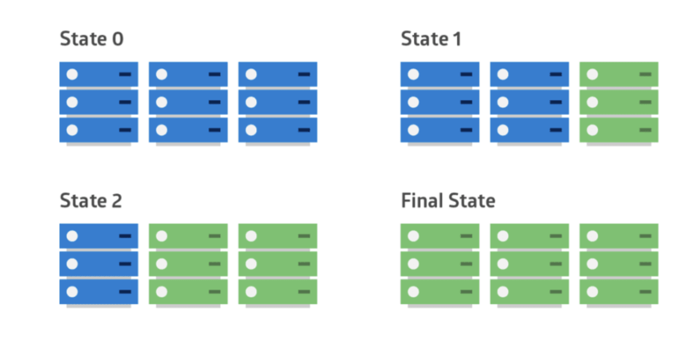
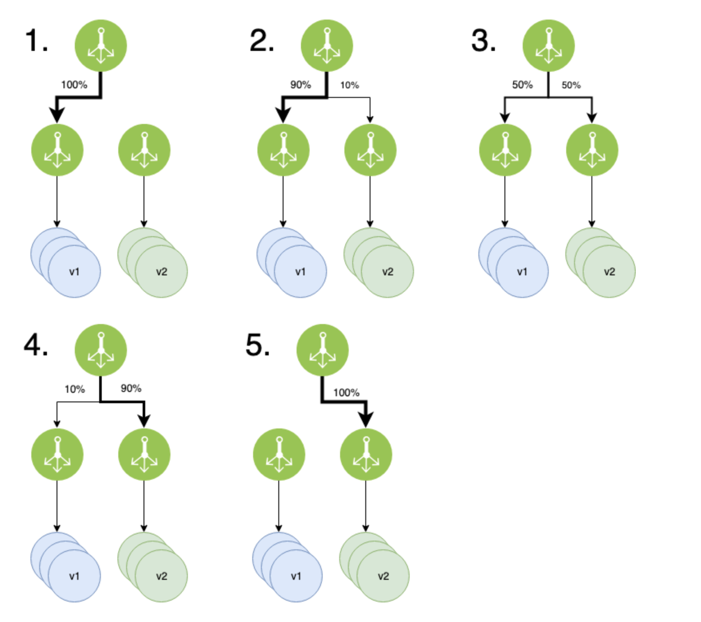

# 무중단 배포

무중단 배포 전략에는 여럿 있다. 우선

1. Rolling

    

    - 일반적인 배포를 의미하고, 단순하게 서버를 구성해 배포하는 전략이다. 다시 말해 구 버전에서 신 버전으로 트래픽을 점진적으로 전환하는 배포이다. 관리가 편하지만, 배포 중 한쪽 인스턴스의 수가 감소되므로 서버 처리 용량을 미리 고려한다.
    - 추가적인 서버가 필요하지 않다.
    - 이전버전과 새로운버전의 환경이 고립되지 않기 때문에 Blue-green보다 빠르지만 단점은 고립되지 않아 롤백이 어렵다는 것이다. 배포한 서버가 잘못된다면 롤링방식을 똑같이 이용해 롤백해야 한다.
2. in-place
    - 인스턴스같은 인프라 컴포넌트의 교체 없이 버전을 업데이트하는 방식이다.
    - 현재 가동중인 서버 그대로 무중단 배포를 구현하기 때문에 현재위치 배포라고 불린다.
3. blue-green

    

    - 분리되지만 동일한 환경을 만들어야 한다.
    - 구 버전을 블루, 신 버전을 그린 이라고 해서 붙여진 이름이다. 신 버전을 배포하고 일제히 전환하여 모든 연결을 신 버전을 바라보게 하는 전력이다. 구 버전, 신 버전 서버를 동시에 나란히 구성하여 배포시점에 트래픽이 일제히 전환된다. 빠른 롤백이 가능하고, 운영환경에 영향을 주지 않고 실제 서비스 환경으로  신버전 테스트가 가능하다. 단 이런 구성은 시스템 자원이 두배로 필요하여 비용이 더 많이 발생
    - 장점은 배포속도가 빠르며, 장애가 발생했을때 로드 밸런서가 기존서버를 가리키기만 하면 되기 때문에 롤백이 쉽다.
    - 업데이트를 진행하는 도중에서 서버수는 그대로 유지되기 때문에 기존 사용되던 그대로 서버를 업데이트 하면된다. 그래서 부하가 걸릴 문제를 생각하지 않아도 된다.
    - 만약 서버가 가상환경이 아니고 물리적인 서버로 존재한다면 아무리 돈이 많은 회사도 서버를 두배로 늘렸다가 필요없어지면 줄이는 비효률을 선택할 수 없다.
    따라서 물리적으로 존재하는 서버에서는 사용하기 어려우며 현재위치 배포 방식이 더 어울린다.
    또 인스턴스를 쉽게 생성하고 지울 수 있는 클라우드 환경이나. 컨테이너를 올렸다가 내리는 것이 자유로운 Docker등 가상환경에 어울린다.

4. carney

    

    - 카나리는 새를 의미하는데 유독가스에 굉장히 민감한 동물로 광산에서 위험을 알리는 용도로 사용되어왔다. 즉, 미리 위험을 감지하기 위해 사용하는 배포 방식이다.
    - 카나리 배포는 위험을 빠르게 감지할 수 있는 배포 전략이다. 지정한 서버 또는 특정 user에게만 배포했다가 정상적이면 전체를 배포한다. 서버의 트래픽을 일부를 신 버전으로 분산하여 오류 여부를 확인할 수 있다. 이런 전략은 A/B 테스트가 가능하며, 성능 모니터링에 유용하다. 트래픽을 분상시킬 떄는 라우팅을 랜덤하게 할 수 있고 사용자로 분류 할 수도 있다.
    - 가장 흥미가 생겼던 배포방식이다.
        - 조금씩 사용자의 범위를 늘려가며 피드백을 통해 배포하는 방식(실제 인스타그램에서 친구들과 다른버전의 인스타를 목격한적이 있다.)
        - 단계별 배포를 의미한다.
        - 장점만 존재하는 것이 아니다. 대표적인 장점이 관리비용이 너무 크다는 것.
        - 버전관리를 위해 동시에 여러개의 소프트웨어 버전을 관리해야 하는 것이다.
        - 로드벨런서가 필요하다. ec2 nginx로 흉내를 낼수 있을 것 같지만 굉장한 낭비라고 생각
    - A/B Testing 과의 차이
        - 기술적 구현의 유사성으로 A/B Testing을 구현하는 방법이 될 수 있지만 둘은 다른 개념
        - 카나리 배포는 문제를 발견하고 이상이 있는 경우 롤백하는 것에 초점이 맞춰져 있지만
        - A/B Testing 은 하나의 가설을 다양한 구현체를 사용하여 테스트하는것을 목적으로 하기 떄문이다.

# in-place + Blue-Green 컨샙 사용

- 이런 방식을 사용한 이유

    각각방식에는 장단점이 있다.

    우선 Rolling 은 추가적인 서버가 필요하지 않는 장점이 있지만 다른 버전의 서버들이 고립되지 않아 롤백이 어렵다는 것이다. 배포한 서버가 잘못된다면 배포→ 롤백 → 배포 롤링 방식을 똑같이 이용해 롤백해야 한다.

    또 서버를 나눠서 업데이트하기 떄문에 중단된 서버의 요청을 나머지 서버가 감당해야한다. 갑자기 사용자가 몰리면 문제가 생길 것이라고 생각했다.

    우리가 알고있는 Blue-Green은 리소스의 낭비가 클 것이라고 생각했다. EC2 인스턴스를 여러개 돌린다는 것은 우리같은 학생입장에서 너무 큰 낭비이다. 또 로드벨런서가 필요한데 로드벨런서역할을 할 Nginx를 위한 인스턴스를 만드는것 또한 낭비라고 생각했다.

    카나리 배포 또한 로드벨런서가 필요했고 만약에 로드벨런서와 모든 환경을 갖추고 난 뒤 해당 배포전략을 사용한다고 해도 구 버전의 서버와 신 버전의 서버를 같이 관리해야하는 것 또한 문제라고 생각했다. 팀원이 5명이다.

    현재 우리서버는 EC2에 docker 를 사용해 Nginx 와 application 서버를 돌리고 있다.

    즉 인스턴스를 생성하고 지우는데 편했고 htop를 이용해 본결과 현재 3기가의 컴퓨터 자원중 700m밖에 사용하지 않았다. 퍼센트로 계산해보면 20퍼샌트도 안되는 값이다.

    안정적인 서비스를 위한 CPU사용율이 최대 70퍼센트인 수치와 비교를 했을때 크게 부족한 수치이다. 따라서

    도커를 이용해 하나의 인스턴스 내에서 여러 서버 그룹을 만들어 Blue-green 방식의 컨셉을 사용해 무중단배포를 하기로 했다.

    
    
```shell script
#!/bin/bash
CURRENT_PORT=$(docker ps | grep springboot | awk {'print $11'}| awk -F '/' {'print $1'} | awk -F '->' {'print $2'})
CURRENT_IP=$(cat /etc/nginx/sites-available/service-url.inc | grep -o http://172.* | sed 's/;$//')
echo $CURRENT_PORT
SERVER1=8080
SERVER2=8081

if [ $CURRENT_PORT -eq $SERVER1 ]
then
        echo " > 현재 SERVER_PORT: $CURRENT_PORT , SERVER2 CONTAINER 실행"
        IDLE_PROFILE=$SERVER2
        IDLE_PORT=8081

        sudo docker build --force-rm -t chat .
        sudo docker rmi $(docker images -f "dangling=true" -q)
        sudo docker stop springboot2
        sudo docker rm $(sudo docker ps -a -f "name=springboot2" -q)
        sudo docker run -d -p 8081:8081 --volume /home/ubuntu/seller-lee/log:/back/build/libs/log --name springboot2 springboot
        CONTAINER_ONE_IP=`sudo docker inspect -f "{{ .NetworkSettings.IPAddress }}" springboot1`
        CONTAINER_TWO_IP=`sudo docker inspect -f "{{ .NetworkSettings.IPAddress }}" springboot2`

        if [ "$(docker ps | grep springboot2)" ]
        then
		        for retry_count in {1..10}
			do
                        response=$(curl -s https://${CONTAINER_TWO_IP}:${SERVER2})
                        count=$( echo $response | grep Download | wc -l)

                        if [ $count -ge 1 ]
                        then
                                echo " > health check 성공"
                                break
                        else
                                echo "> Health check의 응답을 알 수 없거나 혹은 status가 UP이 아닙니다."
                                echo "> Health check: ${response}"
                        fi

                        if [ $retry_count -eq 10 ]
                        then
                                echo "> Health check 실패. "
                                echo "> Nginx에 연결하지 않고 배포를 종료합니다."
                                exit 1
                        fi

                        echo "> Health check 연결 실패. 재시도..."
                        sleep 10
              done
                echo " > 변경할 SERVER_PORT: $SERVER1 , CONTAINER_IP: $CONTAINER_ONE_IP 실행 완료"
                echo " > 변경 SERVER_PORT: $SERVER2 , CONTAINER_IP: $CONTAINER_TWO_IP 실행 완료"
                sudo sed -i "s/$CONTAINER_ONE_IP:$SERVER1;/$CONTAINER_TWO_IP:$SERVER2;/g" /etc/nginx/sites-available/service-url.inc
                docker exec nginx nginx -s reload
                docker stop springboot1
                docker rm springboot1
                echo " > CONTAINER_IP: $CONTAINER_ONE_IP 종료"
        fi

elif [ $CURRENT_PORT -eq $SERVER2  ]
then
        echo " > 현재 SERVER_PORT: $CURRENT_PORT , SERVER1 CONTAINER 실행"
        IDLE_PROFILE=$SERVER1
        IDLE_PORT=8080

        sudo docker build --force-rm -t chat .
        sudo docker rmi $(docker images -f "dangling=true" -q)
        sudo docker stop springboot1
        sudo docker rm $(sudo docker ps -a -f "name=springboot1" -q)
        sudo docker run -d -p 8080:8080 --volume /home/ubuntu/seller-lee/log:/back/build/libs/log --name springboot1 springboot
        CONTAINER_ONE_IP=`sudo docker inspect -f "{{ .NetworkSettings.IPAddress }}" springboot1`
        CONTAINER_TWO_IP=`sudo docker inspect -f "{{ .NetworkSettings.IPAddress }}" springboot2`

        if [ "$(docker ps | grep springboot1)" ]
        then
                sudo sed -i "s/$CONTAINER_TWO_IP:$SERVER2;/$CONTAINER_ONE_IP:$SERVER1;/g" /etc/nginx/sites-available/service-url.inc
		echo " > 변경할 SERVER_PORT: $SERVER1 , CONTAINER_IP: $CONTAINER_ONE_IP 실행 완료"
               	for retry_count in {1..10}
               	do
                      	response=$(curl -s https://${CONTAINER_ONE_IP}:${SERVER1})
                       	count=$( echo $response | grep Download | wc -l)

                       	if [ $count -ge 1 ]
                       	then
                       	        echo " > health check 성공"
                       	        break
                       	else
                       	        echo "> Health check의 응답을 알 수 없거나 혹은 status가 UP이 아닙니다."
                       	        echo "> Health check: ${response}"
                       	fi
	
                       	if [ $retry_count -eq 10 ]
                       	then
                       	        echo "> Health check 실패. "
                       	        echo "> Nginx에 연결하지 않고 배포를 종료합니다."
                       	        exit 1
                       	fi

                       	echo "> Health check 연결 실패. 재시도..."
                       	sleep 10
		done
                docker exec nginx nginx -s reload
                docker stop springboot2
                docker rm springboot2
                echo " > CONTAINER_IP: $CONTAINER_TWO_IP 종료"
        fi
fi  
``` 

- 참고
    - [https://reference-m1.tistory.com/211](https://reference-m1.tistory.com/211)
    - [https://onlywis.tistory.com/10](https://onlywis.tistory.com/10)
    - [https://tech.devsisters.com/posts/blue-green-canary-deployment/](https://tech.devsisters.com/posts/blue-green-canary-deployment/)
    - [https://medium.com/sjk5766/nginx-docker를-활용한-무중단-배포맛보기-8b4f8571ab24](https://medium.com/sjk5766/nginx-docker%EB%A5%BC-%ED%99%9C%EC%9A%A9%ED%95%9C-%EB%AC%B4%EC%A4%91%EB%8B%A8-%EB%B0%B0%ED%8F%AC%EB%A7%9B%EB%B3%B4%EA%B8%B0-8b4f8571ab24)
    - [https://gist.github.com/ninanung/9d63304cb0d070642e89f9b94b6fe24b](https://gist.github.com/ninanung/9d63304cb0d070642e89f9b94b6fe24b)
    - [https://chigon.tistory.com/entry/성능-테스트시-서버-모니터링-방법-정리](https://chigon.tistory.com/entry/%EC%84%B1%EB%8A%A5-%ED%85%8C%EC%8A%A4%ED%8A%B8%EC%8B%9C-%EC%84%9C%EB%B2%84-%EB%AA%A8%EB%8B%88%ED%84%B0%EB%A7%81-%EB%B0%A9%EB%B2%95-%EC%A0%95%EB%A6%AC)
    - [https://blog.dramancompany.com/2017/04/aws-code-deploy를-통한-배포-자동화/](https://blog.dramancompany.com/2017/04/aws-code-deploy%EB%A5%BC-%ED%86%B5%ED%95%9C-%EB%B0%B0%ED%8F%AC-%EC%9E%90%EB%8F%99%ED%99%94/)
    - [둔치의 개발 이야기](https://dunchi.tistory.com/69)
    - [aws](https://d1.awsstatic.com/whitepapers/overview-of-deployment-options-on-aws.pdf)
    
- script 참고
    - [#!bin/bash 의 의미](https://hahoital.tistory.com/145)
    - [Shell script(쉘) if 조건문, 조건식](https://hand-over.tistory.com/32)
    - [(리눅스 / 유닉스 / 셸 스크립트) 조건문과 함께 쓰이는 test 명령어 사용법 및 활용 예시](https://jhnyang.tistory.com/146)
    - [(리눅스 / 유닉스 / 셸 스크립트) IF문 조건문 - 셸 프로그래밍 기초](https://jhnyang.tistory.com/147)
    - [\[Linux\] Shell 명령어에서 &&와 ;의 차이](https://twpower.github.io/36-difference-between-logical-AND-and-semicolon-in-shell-command)
    - [Bash 입문자를 위한 핵심 요약 정리 (Shell Script)](https://blog.gaerae.com/2015/01/bash-hello-world.html)
