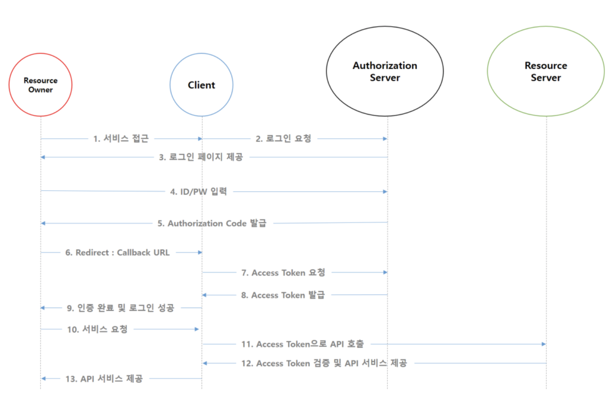

#### OAuth2 과정
OAuth는 인터넷 사용자들이 비밀번호를 제공하지 않고 다른 웹사이트 상의 자신들의 정보에 대해 
웹사이트나 애플리케이션의 접근 권한을 부여할 수 있는 공통적인 수단으로서 사용되는, 접근 위임을 위한 개방형 표준이다

사용자가 서비스에게 접근 권한을 위임한다고 생각할 수 있다.

- 인증은 시스템 접근을 확인하는 것 (로그인) -> 인증만 하는 것은 [openID](https://coffeewhale.com/kubernetes/authentication/oidc/2020/05/04/auth03/)
- 권한은 행위의 권리를 검증하는 것

1. 사용자는 우리서비스에 oauth로 이용하기로 하고 접근을 하면 우리 서비스는 client id, clientSecret, redirect url을 함께 로그인 요청을 보낸다. 
2. Authorization sever는 로그인 페이지를 제공한다. (사용자 인증)
3. 사용자가 로그인을 하면 임시코드인 Authorization code(만료시간이 있음)를 우리서비스가 보낸 redirect uri 와 등록된 redirect url가 동일한지 확인하고 해당 url로 redirect 한다. 
4. 우리 서비스는 받은 코드를 이용해 AccessToken을 요청하고 발급받으면 **이제 서비스는 사용자에게 접근권한을 위임받은 것이다.** (Authorization code로 client 인증)

#### OAuth 취약점
피싱사이트를 이용해 여러개 연동을 할 수 있는 서비스에 공격자의 계정을 등록할 수 있다.
Authorization 값을 공격자의 값으로 바꿔치키 한다면 피해자가 가입한 계정은 공격자의 계정으로 가입이 될 것이다.
[참고](https://aboutsc.tistory.com/200?category=671894)