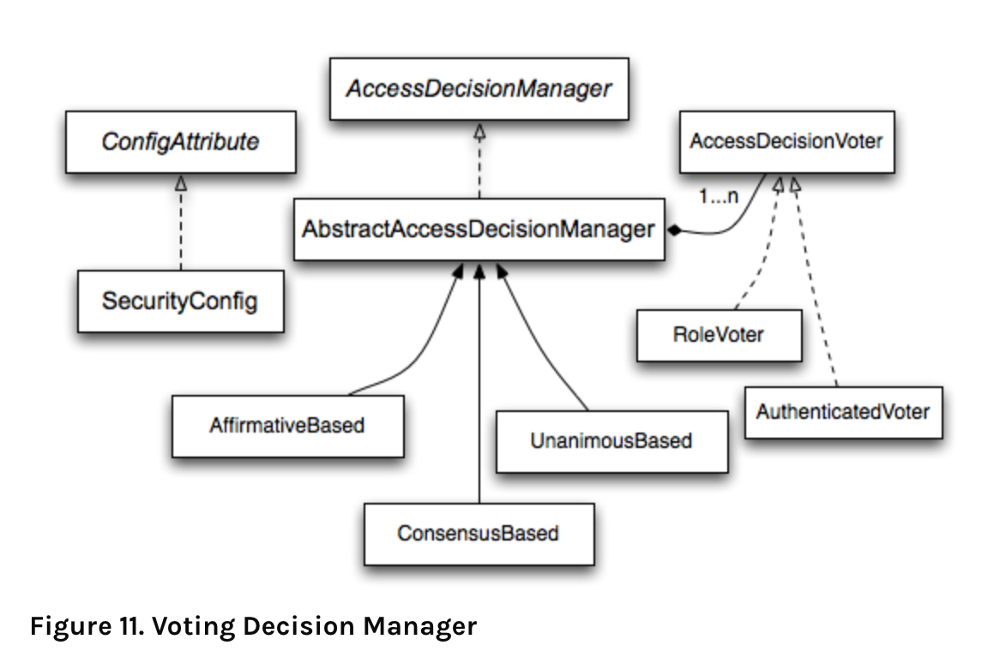
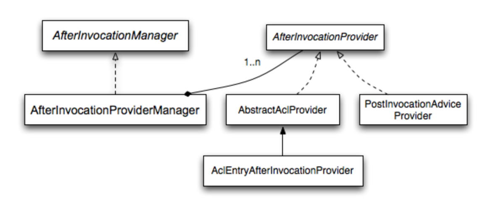
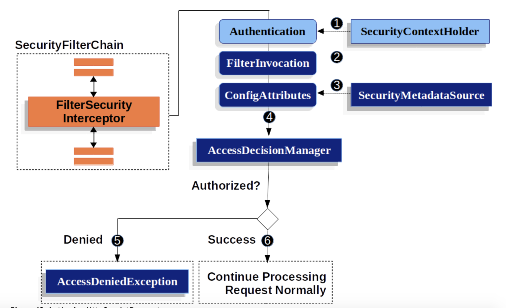

- [Spring Security 주요 Filtter](#spring-security-주요-filtter)
  * [필터 동작원리](#필터-동작원리)
  * [DelegatingFilterProxy](#delegatingfilterproxy)
  * [FilterChainProxy](#filterchainproxy)
  * [SecurityFilterChain](#securityfilterchain)
  * [공부하다 알게 된 내용 context](#공부하다-알게-된-내용-context)
  * [ExceptionTranslationFilter](#exceptiontranslationfilter)
    + [주의](#주의)
    + [해당 필터 관련 troubleShooting](#해당-필터-관련-troubleshooting)
- [Authentication Architectures](#authentication-Architectures)
  * [Authentication Flow](#authentication-flow)
  * [AuthenticationManager](#authenticationmanager)
  * [ProviderManager](#providermanager)
  * [AbstractAuthenticationProcessingFilter](#abstractauthenticationprocessingfilter)
- [Authorization Architecture](#authorization-architecture)
  * [AccessDecisionManager](#accessdecisionmanager)
    + [Voting-Based AccessDecisionManager Implementations](#voting-based-accessdecisionmanager-implementations)
  * [AccessDecisionVoter](#accessdecisionvoter)
  * [ConfigAttributes 와 Object](#configattributes-와-object)
  * [FilterSecurityInterceptor](#filtersecurityinterceptor)
    + [FilterSecurityInterceptor의 프로세스](#filtersecurityinterceptor의-프로세스)
    + [AbstractSecurityInterceptor](#abstractsecurityinterceptor)
  * [Filter 기반의 Spring Security(JwtAuthenticationToken)](#filter-기반의-spring-securityjwtauthenticationtoken)
# Spring Security 주요 Filtter
## 필터 동작원리


Spring Security는 서블릿 필터 기반이라 먼저 필터의 역할을 알고 간다면 많은 도움이 될 것입니다.
어떤 요청이 들어온다면 컨테이너는 필터들과 서블릿을 만듭니다. 보통 하나의 서블릿은 하나의 request, reponse만 다룰 수 있지만, 필터들은 체인으로 연결되어있어
다음 필터에서 쓸HttpServletRequest 와 HttpServletResponse 수정합니다.
Chain으로 연결되어있기 때문에 순서가 중요합니다.

## DelegatingFilterProxy
Spring의 ApplicationContext와 Servlet Container의 lifecycle 의 사이를 연결해주는 역할을 합니다.
Servlet Container는 그들의 표준에 따라 필터를 등록하는데 스프링 빈에 대해서는 인지하지 못합니다. 따라서
DelegatingFilterProxy 가 Servlet Container 표준을 통해 Bean을 필터로 등록해주는 역할을 합니다.

또 DelegatingFilterProxy 을 사용함으로써 Spring Bean 등록 시점과 필터의 등록 시점이 맞지 않는 부분도 해결해줍니다.
Filter는 Servlet Container가 시작되기 전에 필터를 등록할 필요가 있는데 Spring Bean은 그 이후에 등록이 됩니다.
따라서 DelegatingFilterProxy 를 통해 Filter Bean을 lazy 하게 등록할 수 있습니다.

> Another benefit of DelegatingFilterProxy is that it allows delaying looking Filter bean instances. This is important because the container needs to register the Filter instances before the container can startup. However, Spring typically uses a ContextLoaderListener to load the Spring Beans which will not be done until after the Filter instances need to be registered.

## FilterChainProxy
FilterChainProxy 는 Spring Security에 의해 관리되는 특수한 필터입니다. FilterChainProxy 는 SecurityFilterChain를 통해서 많은 필터들에 역할을 위임합니다.
FilterChainProxy 는 Bean이기 때문에 DelegatingFilterProxy에 의해 관리됩니다(wrapped in).

## SecurityFilterChain
FilterChainProxy 가 사용을 합니다. 어떤 필터를 호출할지 결정합니다.


Security Filter 들은 Bean 이지만 DelegatingFilterProxy Filter에 의해 등록되는 것이 아니라 FilterChainProxy 에 상태값으로 갖고있습니다.

여기에는 다양한 이유가 있습니다.

1. Spring Security servlet support의 시작점을 알려줍니다. 만약 Spring Security 에 문제가 생겼을 때
FilterChainProxy를 디버깅을 해보면 바로 알 수 있기 때문에 이점이 있습니다. DelegatingFilterProxy는 시큐리티의 필터가 아닙니다.
DelegatingFilterProxy는 Spring의 ApplicationContext에서 얻은 Filter Bean를 대신 실행하는 것입니다.
package 위치를 보면 `springframework.web.filter` 로 시큐리티가 아님을 알 수 있습니다.

2. Spring Security의 중심이기 때문에 옵션으로 선택되지 않은 명령어를 실행할 수 있습니다.
예를 들어 SecurityContext는 매 요청이 끝나고 나서 메모리 누수를 막기 위해 항상 Clear 해야 하는데
그런 일을 맡아서 할 수 있습니다. 또 Spring Security’s HttpFirewall을 적용해 특정 공격으로부터 막을 수 있습니다.

3. SecurityFilterChain를 유연하게 가져갈 수 있다. 서블릿 컨테이너 필터는 URI를 기반으로 처리한다.
그런데 SecurityFilterChain는 RequestMatcher interface를 사용해서 HttpServletRequest안에 있는 값으로
기반을 설정할 수 있다.

그래서 FilterChainProxy 사실 어떤 SecurityFilterChain 를 사용할지 고르는데 사용될 수 있습니다.


이 부분은 Security 설정에 있어서 중요합니다. SecurityFilterChain 들에 순서가 있기 때문에
만약 /\*\*, /api/\*\* 순서로 설정을 했다면 모든 요청이 /** 에 match 되어  /api/\*\* 에 대해서는 match 되지 않을 것입니다. 앞에서 다 가로채는 것이죠

이해하기 좋게 제가 이번에 설정한 시큐리티 설정에 관해서 이야기 해드리겠습니다.

이렇게 설정이 되어있다면 /oauth2/** 에 대한 URL은 첫 번째 matcher 때문에 도달하지 않을 것입니다.

그렇기 때문에 match 순서에 유의해야 합니다.

**-----수정------**

위와 같은 설정은 단지 하나의 패턴에 set을 통해 append처럼 이어붙어나가는 것이라고 합니다.
FilterChainProxy는 config 하나당 하나의 SecurityFilterChain 만듭니다. 따라서 2개의
config를 만들어 order로 설정해야 합니다.

- 참고
    - [docs](https://docs.spring.io/spring-security/site/docs/5.3.3.BUILD-SNAPSHOT/reference/html5/#servlet-multi-securityfilterchain-figure)
    - [엔꾸꾸-아키택처](https://pupupee9.tistory.com/113)
    - [stackoverflow](https://stackoverflow.com/questions/53999591/spring-security-oauth2-how-to-add-multiple-security-filter-chain-of-type-resour)
    - [DelegatingFilterProxy FliterChainProxy 빈주입 어떻게?](https://yoon0120.tistory.com/47)
    - [Spring Bean 주입](https://loginfo.dev/SpringBeanLifeCycle)
    
## 공부하다 알게 된 내용 context
이 부분을 공부하다가 context에 대해 자세하게 알게 되었습니다. Spring에서 관리하는 context로
ApplicationContext 와 ApplicationContext를 상속받은 WebApplicationContext 가 있습니다.
WebApplicationContext은 다시 root WebApplicationContext와 Servlet WebApplicationContext 으로 나뉩니다.
root는 모든 servlet에서 공통으로 공유할 수 있는 Bean을 의미합니다. 보통 dao 나 Repository,
비즈니스 서비스와 같이 다른 Servlet 객체에서도 필요한 infrastructure 빈들을 넣습니다. root 가 없다면 Servlet WebApplicationContext 가 root입니다.
WebApplicationContext는 ServletContext를 조합으로 갖고 있습니다. 이는 Servlet Container와 연결하기 위함입니다.

**Servlet Context에서 관리 되는 Filter와 Spring이 링크 될 수 있었던 이유입니다. WebApplicationContext 가 ServletContext를 갖고 있었기 때문입니다.**

### dispatcherServlet 을 2개 이상 쓰는 상황
```gherkin
dispatcher servlet을 2개 두는 구조는 Spring Context가 Root Context와 Servlet Context 
이렇게 2개로 분리되는 상황에서 Servlet Context를 2개 두려고 할때 사용하는 구조입니다.

이렇게 구조를 잡는 경우는 서버쪽 로직은 하나로 통일되어 있지만 그걸 표현하는 클라이언트가 여러가지 일때 사용하는 구조에요.
예를 들어 DB에서 데이터를 조회할때 서버는 조회하는 기능은 같은 기능이지만 표현을 웹페이지로도 보여줄수 있고
또는 restful 형태로 입력을 받아 해당 데이터는 json으로 변환해서 response body에 이렇게 분리해서 보낼수도 있죠.
그럴때 웹페이지쪽으로 처리하는 controller로만 묶어서 그걸로 하나의 dispatcher servlet을 구현할 수 있고, 
restful 쪽 controller만 하나로 묶어서 할 수 있죠.
이런 상황은 아무때나..한다기 보단..웹페이지와 restful이 거의 1대1 대응 형태로 이루어져 나름 분리해서 관리해야 될 필요성이 있을때 그렇게 하는 편입니다.

이렇게 하는 것은 spring 3.x 대에서는 이렇게 하는 식으로 분리해서 운영하면 관리하기도 좋았지만.
spring 3.1에서 profile이 생기면서 환경에 따라 별도로 분리해서 운영해지는게 가능해졌기 때문에 굳이 이렇게 하는 상황은 요즘에는 있지는 않을겁니다.

or

H2 인메모리 DB의 경우, 사용자 dispatcher servlet과는 별개의 서블릿을 등록하여 해당 매핑 주소에서 
DB콘솔을 사용자에게 제공하는 역할을 합니다. 이처럼 사용자 애플리케이션과는 다른 부가 기능을 제공하는 경우에 유용하게 사용할 수도 있습니다.
```

- 참고 
    - [서블릿과 스프링에서 Context(컨텍스트)란?](https://linked2ev.github.io/spring/2019/09/15/Spring-5-서블릿과-스프링에서-Context(컨텍스트)란/)
    - [dispatcherServlet 2개 이상 쓰는 상황](https://okky.kr/article/636063?note=1810641)
    - [stackoverflow](https://stackoverflow.com/questions/31931848/applicationcontext-and-servletcontext)

## ExceptionTranslationFilter
AccessDeniedException과 AuthenticationException을 처리하는 필터입니다. 핵심 메서드는 HandleSpringSecurityException()입니다.
해당 필터가 실행되면 doFilter로 바로 넘어갑니다. 만약 인증 과정 중 AuthenticationException 예외가 발생한다면, AuthenticationEntryPoint를 실행하여 인증을 유도합니다.

HandleSpringSecurityException() 내부에서 일어나는 일들입니다.
1. SecurityContext Clear off
2. request cache에 HttpServletRequest를 저장해두고 인증에 다시 성공했을 때 가져와서 씁니다.
3. credentials 을 요청하기 위해 AuthenticationEntryPoint 를 사용합니다. 예를 들어 log in 페이지로 rediect 와 헤더에 WWW-Authenticate를 보냅니다.

- 인증 과정 중 AuthenticationException 예외가 발생한다면, AuthenticationEntryPoint를 실행하여 인증을 유도한다.
- 인가 과정 중 AccessDeniedException 예외가 발생하면 먼저 현재 Authentication이 익명 사용자인지 확인합니다.
만약 익명사용자라면 AuthenticationEntryPoint를 실행하여 인증을 유도합니다.
익명 사용자가 아니라면, AccessDeninedHandler 에게 위임합니다.
 - AccessDeniedException는 FilterSecurityInterceptor 에서 처리합니다.

AuthenticationEntryPoint 설정은 Filter를 커스텀 해서 만들 수도 있고 `oauth2Login().authorizationEndpoint().baseUri()`를 통해 직접 변경할 수 있습니다.
OAuth2 의 경우 Default AuthenticationEntryPoint 는 /oauth/authentication입니다.

### 주의
ExceptionTranslationFilter가 모든 SecurityFilter의 AuthenticationException, AccessDeniedException예외 처리를 담당하는 것은 아닙니다.
만약 AbstractAuthenticationProcessingFilter 를 상속받은 필터에서 AuthenticationException이 터진다면 내부에서 catch로 잡아 unsuccessfulAuthentication 를 실행시킵니다.
저희 서비스에서는 OAuth2를 사용하기 때문에 OAuth2LoginAuthenticationFilter 에서 catch 될 것입니다.
- AbstractAuthenticationProcessingFilter_doFilter

- unsuccessfulAuthentication

- 참고
    - [엔푸푸](https://pupupee9.tistory.com/112)

### 해당 필터 관련 troubleShooting
JwtAuthentocationFilter를 만들때 계속 AuthenticationException를 캐치를 못 하는 상황이 발생했었습니다.
원인은 OncePerRequestFilter 내부 doInternalFilter 메서드에 있었습니다. 코드를 보면 해당 doInternalFilter가 try catch로 감싸죠 있었습니다.


따라서 해당 이슈를 해결하기 위해 GernericFilterBean 으로 변경하던가 try catch로 response에 직접 status 값을 넣어주면 해결되었습니다.

- 참고
    - [OncePerRequestFilter 와 일반 Filter 의 차이점은 무엇일까요?](https://github.com/TheDevLuffy/TIL/issues/11)
---
# Authentication Architectures


어플리케이션의 보안 문제는 보통 대체로 Authentication(who are you?) 와 Authorization(what are you allowed to do?) 정도로 요약됩니다.
> Spring Security has an architecture that is designed to separate authentication from authorization

Spring Security 는 authentication 와 authorization 을 분리해 디자인하였습니다.

## Authentication Flow

대략적인 인증 플로우는 위와 같습니다. 요청이 왔을때 HttpSession에서 사용자 인증정보를 조회하고 SecurityContext 저장해서 전달합니다.
요청이 끝나면 원래 기존에 사용된 SecurityContext에서 변경된 정보를 원래 읽어왔던 곳으로 저장하고 SecurityContext를 삭제합니다.

httpSession을 사용하지 않는다면 HttpSession에서 조회학고 저장하는 과정이 없겠죠?

## AuthenticationManager

AuthenticationManager는 어떻게 Spring Security의 필터가 Authentication을 수행할지 정의해둔 API 입니다.
> If you are not integrating with Spring Security’s Filters you can set the SecurityContextHolder directly and are not required to use an AuthenticationManager

Spring Security의 필터들과 통합하지 않고 인증을 하기 위해선 그냥 SecurityContextHolder 에 바로 저장하면 된다고 앞서 말씀드린 것처럼 나와있네요 :)

```java
public interface AuthenticationManager {
  Authentication authenticate(Authentication authentication)
    throws AuthenticationException;
}
```
AuthenticationManager의 authenticate()는 3가지중 한가지를 return합니다

1. return an Authentication (normally with authenticated=true) if it can verify that the input represents a valid principal.
2. throw an AuthenticationException if it believes that the input represents an invalid principal.
3. return null if it can’t decide.

AuthenticationException은 Runtime Exception입니다. 해당 Exception은 유저 코드에서 예외를 처리한다고 생각하지 않기 때문에 
보통 웹 어플리케이션에 의해 웹 UI는 인증이 실패했다는 페이지를 렌더링하고 백엔드 HTTP 서비스는 컨텍스트에 따라 WWW-Authenticate 헤더가 있든 없든 401 응답을 전송합니다.

## ProviderManager
AuthenticationManager의 가장 일반적인 구현체로 스프링에서 인증을 담당하는 클래스로 볼 수 있습니다.
(Spring Security가 직접 관리하는 빈이기때문에 따로 구현해줄 필요가 없습니다. 직접 구현하는 경우는 매우 드믈다고 합니다.)
하지만 직접 인증 과정을 진행하는게 아니라 멤버 변수로 가지고 있는 `private List<AuthenticationProvider> providers;`
들을에게 support()로 인증가능한지 묻고 가능하면 인증을 위임처리하고 그 중에 하나의 AuthenticationProvider(명확하게는 AuthenticationProvider를 구현한 클래스)객체가 인증 과정을 거쳐서 인증에 성공하면 요청에 대해서
ProviderManager가 UserDetailsService(저희 서비스는 OAuth2UserService를 사용합니다.)에서 비밀번호와 같은 정보를 세션에 오랫동안 저장하지 않기 위해 새로운 Authentication을 리턴합니다.
즉 같은 애플리케이션이라도 인증방법을 여러가지 메커니즘으로 갖을 수 있습니다.

**Authentication 객체의 타입마다 처리할 수 있는 Provider가 다르기 때문입니다.**
- UsernameAuthenticationToken 는 UsernamePasswprdAuthenticationFilter
- OAuth2LoginAuthentication 는 OAuth2LoginAuthenticationFilter

인증이 되었다고 알려주는 건 AuthenticationManager 인터페이스의 메서드인 authenticate() 메서드의 리턴 값인 Authentication객체 안에 인증 값을 넣어주는 것으로 처리합니다.
```java
public interface AuthenticationProvider {
	Authentication authenticate(Authentication authentication)
			throws AuthenticationException;

	boolean supports(Class<?> authentication);
}
```
parent provider 를 Optional 하게 갖을 수 있습니다. 모든 등록된 List 로 등록된 프로바이더가 support() 할게 없다면 parent provider를 호출합니다.

모든 provider가 실패했을때 parant가 존재한다면 parant를 실행히키고 이마저도 실패한다면 Exception을 터트립니다.


AuthenticationManager를 커스텀 하기 위해선 global Authentication을 해주려면 @Autowired를
local Authentication는 @Override를 해주면 설정 가능합니다. 
```java
@Configuration
public class ApplicationSecurity extends WebSecurityConfigurerAdapter {

   ... // web stuff here

  @Autowired
  public void initialize(AuthenticationManagerBuilder builder, DataSource dataSource) {
    builder.jdbcAuthentication().dataSource(dataSource).withUser("dave")
      .password("secret").roles("USER");
  }

  @Override
    public void configure(AuthenticationManagerBuilder builder) {
      builder.jdbcAuthentication().dataSource(dataSource).withUser("dave")
        .password("secret").roles("USER");
    }

}
```

여기서 @Autowired는 ConfigGlobal 내의 AuthenticationManagerBuilder를 주입 받겠다는 뜻입니다.
parent는 없어도 괜찮습니다. local AuthenticationManager를 잘 등록해주면 됩니다.
왜인지모르겠는데 FormLogin은 local AuthenticationManager 설정을 해주어야하고 OAuthLogin() 을 사용하면 자동으로 local AuthenticationManager 등록을 해줍니다.


**ProviderManager.java** 의 authenticate(Authenticate )를 보면 흐름을 알 수 있습니다.

## AbstractAuthenticationProcessingFilter
AbstractAuthenticationProcessingFilter 는 유저의 credentials를 인증하기 위해서 사용되는 필터입니다.

credentials이 인증되기 전에, Spring Security는 보통 AuthenticationEntryPoint를 사용해 credentials 을 요청합니다.

인증이 완료되었다면 Parent (AbstractAuthenticationProcessingFilter)로 이동합니다.
- attemptAuthentication()
    - TemplateMethod Pattern이 적용되어있습니다.
        - 부모의 일부분을 자식이 구현하는 구조
- 인증이 완료된 뒤에는 기존에 요청을 했던 URL로 보냅니다.


1. credentials 이 주어지면 AbstractAuthenticationProcessingFilter는 HttpServletRequest에서 Authentication을 만듭니다.
만들어진 Authentication 타입은 AbstractAuthenticationProcessingFilter에 따라 다릅니다.
예를들어  UsernamePasswordAuthenticationFilter는 UsernamePasswordAuthenticationToken을 만듭니다.
2. 그 후 AuthenticationManager(ProviderManger) 에게 위임합니다.
3. 만약 인증이 실패할 경우 
    1. SecurityContextHolder를 clear 합니다.
    2. RememberMeAuthenticationFilter를 사용하면 RememberMeServices.loginFail 를 호출합니다.
    3. AuthenticationFailureHandler가 호출됩니다.
4. 인증이 성공할 경우
    1. SessionAuthenticationStrategy에 새로운 로그인에 대해 알립니다.       
    2. SecurityContextHolder에 SecurityContext를 저장합니다.
    3. 세션을 사용하면 SecurityContextPersistenceFilter는 HttpSession에 SecurityContext를 저장합니다.
    4. RememberMeAuthenticationFilter 사용하면 RememberMeServices.loginSuccess를 호출합니다.
    5. AuthenticationSucessHandler가 호출됩니다.

RememberMeAuthenticationFilter는 RememberMeToken을 사용할때 로그인 세션을 오랫동안 유지하기 위해 사용됩니다.

# Authorization Architecture

## AccessDecisionManager
AccessDecisionManager 는 인증이 완료된 사용자가 리소스에 접근하려고 할때 해당 요청을 허용할 것인지 판단하는 인터페이스 입니다.

즉, Pre-Invocation Handling 를 담당하고 있습니다. Pre-Invocation Handling 는 메서드나 web request가 되기전에 Intercept 해서 access가 가능한지 핸들링하는 것입니다.
AbstractSecurityInterceptor 라고도 불립니다.
- AccessDecisionManager Interface
```java
void decide(Authentication authentication, Object secureObject,
    Collection<ConfigAttribute> attrs) throws AccessDeniedException;

boolean supports(ConfigAttribute attribute); ...(1)

boolean supports(Class clazz); ...(2)
```
decide()는 인가 결정을 내리는 메서드 입니다. 꼭 필수적으로 구현해야하는 메서드입니다.
(1)은 AccessDecisionManager가 ConfigAttribute 를 처리할수 있는지 확인하기 위해 AbstractSecurityInterceptor의해 호출됩니다.
(2)은 구현체가 실행하는데 AccessDecisionManager가 해당 인가를 처리할 수있는지 판단합니다.

### Voting-Based AccessDecisionManager Implementations
AccessDecisionManager 구현체는 3가지를 기본으로 제공하고 있습니다.
- Voter 라는 개념을 가지고 있습니다.
- Voter는 의사결정을 내리는데 사용하며 여러개의 Voter를 가질 수 있습니다.
- **AffirmativeBased**: 여러 Voter중에 하나라도 허용되면 허용됩니다. (기본 전략)
- ConsensusBased: 다수결
- UnanimousBased: 만장일치
모든 Voter가 허용하지 않는다면 예외를 발생시킵니다.

## AccessDecisionVoter

- 어떠한 옵션도 없다면 Voter는 ACCESS_ABSTAIN(보류) 을 던져 의사결정을 내리지 않을 것입니다.
- 해당 Authentication이 특정한 Object에 접근할때 필요한 ConfigAttributes 를 만족하는지 확인합니다.
- WebExpressionVoter: 웹 시큐리티에서 사용하는 기본 구현체이다. 현재 인증된 사용자가 가지고있는 권한이 ROLE_XXXX 가 매치되는지 확인하는 역할을 합니다.
- RoleHierarchyVoter: 계층형 ROLE을 지원합니다. ADMIN > MANAGER > USER > GUEST
- AccessDecisionManager의 decide 메서드는  AccessDecisionVoter목록들을 가져와 인가를 진행하는데 이때 기본 전략으로 사용되는 Voter는 WebExpressionVoter 입니다.
앞서 설명한 것과 동일하게 권한코드는 ROLE_을 기본 prefix로 가지고 있기때문에 다른 prefix를 사용하려면 DefaultWebSecurityExpressionHandler의 `defaultRolePrefix`를 변경하면 됩니다.
- 익명사용자와 인증된사용자를 나누기 위한 AuthenticatedVoter도 있습니다.

## ConfigAttributes 와 Object
   Security 설정과 관련이 있습니다. HttpSecurity를 커스터마이징하여 시큐리티 설정을 변경할 수 있습니다.
   이러한 HttpSecurity를 커스터마이징 하는과정에서 사용된 메서드들이 ConfigAttributes와 관련이 있습니다.
   - 권한을 허용하거나, 인가를 필요로 하는부분 permitAll() 혹은 hasRole() 과 같은 부분이 ConfigAttributes가 되고
   - antMatchers() 에서 지정한 리소스들이 바로 Object에 해당하게 됩니다..


## FilterSecurityInterceptor

FilterChainProxy가 호출하는 Filter중 하나입니다. 대부분은 가장 마지막에 사용되고 어떤 리소스에 접근하기 전 마지막에 AccessDecisionManager를 사용하여 인가처리를 하는 필터입니다.
해당 필터까지 왔다는 것은 user가 인증이 된 객체라는 의미이기도 합니다.
### FilterSecurityInterceptor의 프로세스
1. 사용자가 접근 권한을 설정한 ConfigAttribute(url에 대한 접근 권한) 들을 가져와서 
AccessDecisionManager 에 설정된 voter 들에서 지원하는지 여부를 확인한다. 만약 지원하지 않으면 예외를 발생시킵니다.
2. SecurityContextHolder.getContext().getAuthentication() 를 통해 Authentication 객체를 가져와서 
AccessDecisionManager의 decide() 를 호출합니다.
3. AccessDecisionManager 를 구현한 클래스에서는 자신들이 가지고 있는 voter 들을 순환하면서 vote() 를 호출하여 
ACCESS_XXX 하는 결과 값을 받아 판단한다. 권한이 없는 경우에는 AccessDeniedException 을 발생 시킵니다.

doFilter 메서드에서는 FilterSecurityInterceptor의 invoke메서드를 호출하게 됩니다. invoke 메서드에서 부모 클래스인 AbstractSecurityInterceptor의 method 호출을 통해 인가 처리를 진행합니다.
### AbstractSecurityInterceptor
FilterSecurityInterceptor 의 부모클래스이고 accessDecisionManager를 호출하여 인가합니다.
어떤 리소스에 접근하더라도 이 Filter가 동작하는데 인가에 실패한다면 AccessDeniedException 이벤트를 발생시키고
해당 예외를 처리하는 ExceptionHandling Filter가 존재하고 해당 필터가 처리를 하게 되고, 로그인페이지로 리다이렉트합니다.

- invoke

해당 메서드를 통해 befoeInvocation를 호출합니다. 

- befoeInvocation


obtainSecurityMetadataSource() 를 통해 인가 속성들(ROLE,,)을 가져와서 AccessDecisionManager의 구현체인 AffirmativeBased 의 decide(..)를 통해 인가 결정을 합니다.

Spring Security의 인가처리 구조는 다음과 같습니다.

**FilterChainProxy -> FilterSecurityInterceptor (AbstractSecurityInterceptor) -> AccessDecisionManager(AffirmativeBased) -> AccessDecisionVoter(WebExpressionVoter)-> ExpressionHandler (처리)**

- 참고
    - [docs](https://docs.spring.io/spring-security/site/docs/5.3.3.BUILD-SNAPSHOT/reference/html5/#servlet-authentication)
    - [엔푸푸](https://pupupee9.tistory.com/112)
    - [사용자인증은 어디서 어떻게 할까?](https://sungminhong.github.io/spring/security/)
## Filter 기반의 Spring Security(JwtAuthenticationToken)
Spring Security는 Filter 기반으로 이루어져 있습니다.

이렇게 Filter를 기반으로 한 이유로는 프레임워크 의존성을 없애기 위함입니다. 그래서 Spring MVC와 완전히 분리되어 관리 및 동작합니다.

처음에 JWT를 사용했던 우리 팀의 로그인 프로세스는 dispatcher Servlet을 넘어와 Interceptor에서 요청을 가로채 token의 유효성 검사를 하는 형태였습니다.

Spring context에서 요청에 대해 유효성을 판단하고 있었습니다.

저는 이런 형태가 맞지 않는다고 생각했습니다. Spring MVC와 분리되어 동작하는 Security를 사용하므로 Filter에서 인증과 인가를 처리하는데 그 후 다시 Spring MVC의
Intercept에서 토큰의 유효성 검사해 또 인증 인가를 한 번 더 처리하는 프로세스가 이상하게 느껴졌습니다.

그래서 Filter에서 인증, 인가를 처리하기 직전에 토큰 유효성을 판단해 잘못된 요청이라면 Exception을 터트려 그 이후 필터를 거치지 않도록 바꿔야 생각을 했고

따라서 JwtAuthenticationFilter 늘 만들기로 하였습니다.

- 참고
    - [(Spring)Filter와 Interceptor의 차이](https://meetup.toast.com/posts/151)
    - [Spring의 Filter 와 Interceptor 에 대하여](https://jins-dev.tistory.com/entry/Spring의-Filter-와-Interceptor-에-대하여)
    - [ApplicationContext](https://hoonmaro.tistory.com/31)

